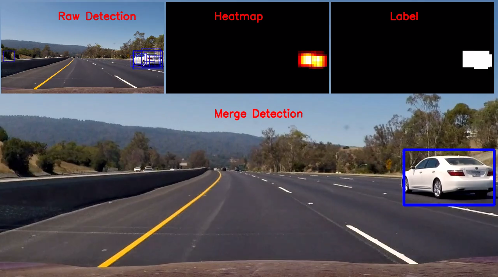

# Vehicle Detection

In this project, a conventional computer vision method **[Histogram of oriented gradients(HOG)](https://www.learnopencv.com/histogram-of-oriented-gradients/)** is implemented with machine learning classifier **[Support Vector Machine(SVM)](https://en.wikipedia.org/wiki/Support_vector_machine)** to perform the vehicle detection. In addition, the result is benchmarked with the state-of-art deep learning methods: **[You only look once version 3 (YOLOv3)](https://pjreddie.com/darknet/yolo/?utm_source=next.36kr.com)** and **[Single Shot MultiBox Detector(SSD)](https://arxiv.org/abs/1512.02325)**.

Result
---
**SVM classifier (click image to check the video)**

Benchmark with:

**YOLOv3 and SSD (click image to check the video)**

Details
---
In this repository contains a lot of ipython notebook files, the functionalities are as following:
* **[train_classifier_hog.ipynb](https://github.com/Tsuihao/CarND-Vehicle-Detection/blob/master/train_classifier_hog.ipynb)**: Explore the dataset and train the SVM classifier

* **[vehicle_detection_hog.ipynb](https://github.com/Tsuihao/CarND-Vehicle-Detection/blob/master/vehicle_detection_hog.ipynb)**: Implement HOG sub-sampling and search the vehicle base on pre-defined grids.

* **[vehicle_detection_YOLOv3.ipynb](https://github.com/Tsuihao/CarND-Vehicle-Detection/blob/master/keras-yolo3-master/vehicle_detection_YOLOv3.ipynb)**: Use [keras-yolo3](https://github.com/qqwweee/keras-yolo3) to perform object detection.

* **[vehicle detection_SSD.ipynb](https://github.com/Tsuihao/CarND-Vehicle-Detection/blob/master/vihicel_detection_SSD.ipynb)**: Use [Tensorflow Object Detection API](https://github.com/tensorflow/models/tree/master/research/object_detection) and pre-trained **ssd_mobilenet_v1_coco_2017_11_17** model to perform object detection.

Requirements and more tech details: **[Write up](https://github.com/Tsuihao/CarND-Vehicle-Detection/blob/master/writeup.md)**

Notes: 
* For using SSD, follow: [keras-yolo3](https://github.com/qqwweee/keras-yolo3)
* For using YOLOv3, follow: [Tensorflow Object Detection API](https://github.com/tensorflow/models/tree/master/research/object_detection)

The Project
---

The goals / steps of this project are the following:

* Perform a Histogram of Oriented Gradients (HOG) feature extraction on a labeled training set of images and train a classifier Linear SVM classifier
* Optionally, you can also apply a color transform and append binned color features, as well as histograms of color, to your HOG feature vector. 
* Note: for those first two steps don't forget to normalize your features and randomize a selection for training and testing.
* Implement a sliding-window technique and use your trained classifier to search for vehicles in images.
* Run your pipeline on a video stream (start with the test_video.mp4 and later implement on full project_video.mp4) and create a heat map of recurring detections frame by frame to reject outliers and follow detected vehicles.
* Estimate a bounding box for vehicles detected.

Data Set
---

Here are links to the labeled data for [vehicle](https://s3.amazonaws.com/udacity-sdc/Vehicle_Tracking/vehicles.zip) and [non-vehicle](https://s3.amazonaws.com/udacity-sdc/Vehicle_Tracking/non-vehicles.zip) examples to train your classifier.  These example images come from a combination of the [GTI vehicle image database](http://www.gti.ssr.upm.es/data/Vehicle_database.html), the [KITTI vision benchmark suite](http://www.cvlibs.net/datasets/kitti/), and examples extracted from the project video itself.   You are welcome and encouraged to take advantage of the recently released [Udacity labeled dataset](https://github.com/udacity/self-driving-car/tree/master/annotations) to augment your training data.  
 
